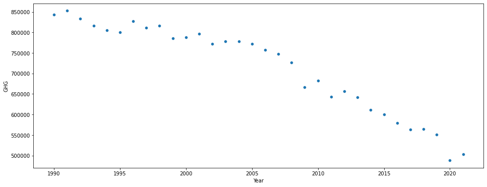

# Project-Regression-NAO

- This project shows the total greenhouse gas (GHG) emissions over the last 30+ years and attempts to model the total GHG emissions for the next 5 years.
- It begins by using pandas a common data analysis and data science library to read in an Excel file from an [ONS](https://www.ons.gov.uk/economy/environmentalaccounts/datasets/ukenvironmentalaccountsatmosphericemissionsgreenhousegasemissionsbyeconomicsectorandgasunitedkingdom) atmospheric emissions data source.
- Then using pandas the data is cleaned to find the most important data and put it into a usable form.
- From here we can plot the emissions for the last 30+ years.

