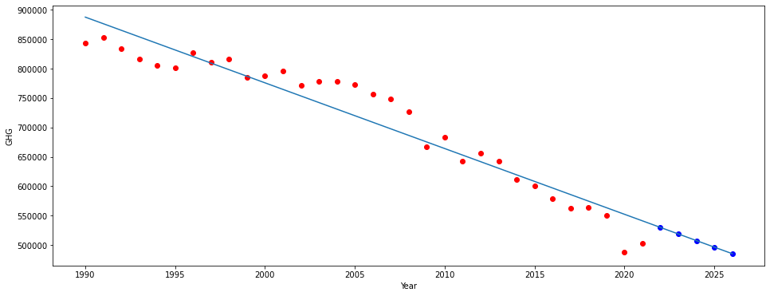

# NAO Greenhouse Gas Emissions - Regression

- This project shows the total greenhouse gas (GHG) emissions over the last 30+ years and attempts to model the total GHG emissions for the next 5 years.
- It begins by using pandas, a common data analysis and data science library, to read in an Excel file from an [ONS](https://www.ons.gov.uk/economy/environmentalaccounts/datasets/ukenvironmentalaccountsatmosphericemissionsgreenhousegasemissionsbyeconomicsectorandgasunitedkingdom) atmospheric emissions data source.
- Then using pandas the data is cleaned to find the year and total GHG emissions. These are then put into a usable form.
- From here we can plot the emissions for the last 30+ years.

- Taking the graph of the last 30+ years into account, to try and predict the next 5 years' GHG emissions I decided to use a standard linear regression model.
- With the data frame including the year and total GHG emissions I used sklearn's linear regression model to predict the value of GHG emissions for the years 2022 to 2026.
- I then added the years and predictions to a data frame. This data frame along with the data frame for the last 30+ years was then used to create a graph of predictions.
- Additionally, I added the linear regression line to this graph.

- With the lack of input data the easiest model to use was a standard linear regression. This also fits the data fairly well as there is a steady downward trend from 1990. However, the data also includes some anomalies, for example, 2020 and 2021 were years heavily affected by COVID-19 and 2009 was affected by the financial crisis. In these years, GHG emissions were considerably lower than in the previous few years. I did look at what caused this steep decline during the COVID-19 pandemic and it seems that transport and storage emissions reduce significantly. In particular, looking at the Excel file Air transport services had a significant reduction during these two years. This is one thing that the linear regression model would take into account. Therefore, it could be argued that these odd years should be dropped from the data.
- Additionally, the graph is not strictly linear therefore it might be better to consider some other option which picks up on the non-linearity of the graph.
- I think with more data like the population size during each year and the amount spent on green initiatives one could get a better understanding of GHG emissions in the UK.
